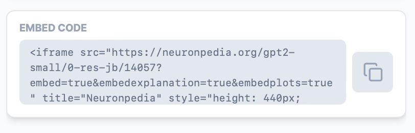

# Embed Features (iframe)

## Basics

Neuronpedia features can be embedded on your site or third-party sites, usually through iframes.

Every feature has an `Embed Code/Link` section with a Copy icon which allows you to quickly paste the iframe code or embed link for that feature.

Alternatively, you can construct your own by simply adding `?embed=true` to the end of any feature's URL.

## Simple Example

The following demonstrates the most basic embed for `GPT2-SMALL@0-RES-JB:14057`:

Feature URL: `https://neuronpedia.org/gpt2-small/0-res-jb/14057`

Embed URL: `https://neuronpedia.org/gpt2-small/0-res-jb/14057?embed=true`

Embed Code: `<iframe src="https://neuronpedia.org/gpt2-small/0-res-jb/14057?embed=true" title="Neuronpedia" style="height: 300px; width: 540px;"></iframe>`

And here's what the embed looks like:

<iframe src="https://neuronpedia.org/gpt2-small/0-res-jb/14057?embed=true" title="Neuronpedia" style={{border: "1px solid #ddd", borderRadius: "10px", width:"540px", height:"300px"}}></iframe>

## Customizations

### Width and Height

You can customize the width and height of the iframe by modifying the style attribute. Note that widths smaller than 640 pixels will result in stacking the dashboard vertically, and show fewer top logits (5 instead of 10).

Here's the example above, with larger width and height:

`<iframe src="https://neuronpedia.org/gpt2-small/0-res-jb/14057?embed=true&embedexplanation=true&embedplots=true" title="Neuronpedia" style={{border: "1px solid #ddd", borderRadius: "10px", width:"645px", height:"420px"}}></iframe>`

<iframe src="https://neuronpedia.org/gpt2-small/0-res-jb/14057?embed=true&embedexplanation=true&embedplots=true" title="Neuronpedia" style={{border: "1px solid #ddd", borderRadius: "10px", width:"645px", height:"420px"}}></iframe>

### Show Activation Testing

Enable or disable showing activation testing by changing query parameter `embedtest` to true or false. This is enabled by default.

#### Enabled

`<iframe src="https://neuronpedia.org/gpt2-small/0-res-jb/14057?embed=true&embedexplanation=true&embedplots=false&embedtest=true" title="Neuronpedia" style={{border: "1px solid #ddd", borderRadius: "10px", width:"480px", height:"300px"}}></iframe>`

<iframe src="https://neuronpedia.org/gpt2-small/0-res-jb/14057?embed=true&embedexplanation=true&embedplots=false&embedtest=true" title="Neuronpedia" style={{border: "1px solid #ddd", borderRadius: "10px", width:"480px", height:"300px"}}></iframe>

#### Disabled

`<iframe src="https://neuronpedia.org/gpt2-small/0-res-jb/14057?embed=true&embedexplanation=true&embedplots=false&embedtest=false" title="Neuronpedia" style={{border: "1px solid #ddd", borderRadius: "10px", width:"480px", height:"300px"}}></iframe>`

<iframe src="https://neuronpedia.org/gpt2-small/0-res-jb/14057?embed=true&embedexplanation=true&embedplots=false&embedtest=false" title="Neuronpedia" style={{border: "1px solid #ddd", borderRadius: "10px", width:"480px", height:"300px"}}></iframe>

### Show Plots

Enable or disable showing the two plots by changing query parameter `embedplots` to true or false. This is enabled by default.

`<iframe src="https://neuronpedia.org/gpt2-small/0-res-jb/14057?embed=true&embedexplanation=true&embedplots=false" title="Neuronpedia" style={{border: "1px solid #ddd", borderRadius: "10px", width:"480px", height:"300px"}}></iframe>`

<iframe src="https://neuronpedia.org/gpt2-small/0-res-jb/14057?embed=true&embedexplanation=true&embedplots=false" title="Neuronpedia" style={{border: "1px solid #ddd", borderRadius: "10px", width:"480px", height:"300px"}}></iframe>

### Show Explanation

Enable or disable showing the explanation (usually auto-interp) by changing query parameter `embedexplanation` to true or false. This is enabled by default.

Here's the example above, without explanation:

`<iframe src="https://neuronpedia.org/gpt2-small/0-res-jb/14057?embed=true&embedexplanation=false&embedplots=true" title="Neuronpedia" style={{border: "1px solid #ddd", borderRadius: "10px", width:"480px", height:"300px"}}></iframe>`

<iframe src="https://neuronpedia.org/gpt2-small/0-res-jb/14057?embed=true&embedexplanation=false&embedplots=true" title="Neuronpedia" style={{border: "1px solid #ddd", borderRadius: "10px", width:"480px", height:"300px"}}></iframe>

### Default Activation Text

You can add a default, custom activation text to the embed. Add the query parameter `defaulttesttext` with the URI-encoded string of what you want in the activation field. For example:

`<iframe src="https://neuronpedia.org/gpt2-small/0-res-jb/14057?embed=true&embedexplanation=true&embedplots=true&defaulttesttext=my+custom+Jedi" title="Neuronpedia" style={{border: "1px solid #ddd", borderRadius: "10px", width:"480px", height:"360px"}}></iframe>`
<iframe src="https://neuronpedia.org/gpt2-small/0-res-jb/14057?embed=true&embedexplanation=true&embedplots=true&defaulttesttext=my+custom+Jedi" title="Neuronpedia" style={{border: "1px solid #ddd", borderRadius: "10px", width:"480px", height:"360px"}}></iframe>

## LessWrong Example

LessWrong supports embedding Neuronpedia features directly in the editor. Just copy paste the embed link (not the iframe code) into the editor. Note that the previews will only show up correctly if you copy-paste, not manually type out the url.

Some example links you can directly paste into the editor:
- `https://neuronpedia.org/gpt2-small/0-res-jb/14057?embed=true&embedexplanation=false&embedplots=true&defaulttesttext=the+Jedi`
- `https://neuronpedia.org/gpt2-small/0-res-jb/14057?embed=true&embedexplanation=false`