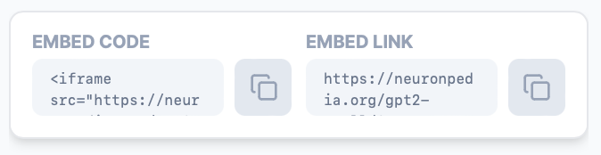

# Embed Features (iframe)

## Basics

Neuronpedia features can be embedded in Iframes on your site or third-party sites.

Every feature has an `Embed Code` section with a Copy icon which allows you to quickly paste the iframe code for that feature.

Alternatively, you can construct your own by simply adding `?embed=true` to the end of any feature's URL and add it in an iframe tag.

## Example

The following demonstrates the embed for `GPT2-SMALL@0-RES-JB:14057`:

Feature URL: `https://neuronpedia.org/gpt2-small/0-res-jb/14057`

Embed URL: `https://neuronpedia.org/gpt2-small/0-res-jb/14057?embed=true`

Embed Code: `<iframe src="https://neuronpedia.org/gpt2-small/0-res-jb/14057?embed=true&embedexplanation=true&embedplots=true" title="Neuronpedia" style="height: 440px; width: 650px;"></iframe>`

And here's what the embed looks like:

<iframe src="https://neuronpedia.org/gpt2-small/0-res-jb/14057?embed=true&embedexplanation=true&embedplots=true" title="Neuronpedia" style={{width:"650px", height:"440px"}}></iframe>

## Customizations

### Width and Height

You can customize the width and height of the iframe by modifying the style attribute. Note that widths smaller than 640 pixels will result in stacking the dashboard vertically, and show fewer top logits (5 instead of 10).

Here's the example above, with smaller width and height:

`<iframe src="https://neuronpedia.org/gpt2-small/0-res-jb/14057?embed=true&embedexplanation=true&embedplots=true" title="Neuronpedia" style={{width:"480px", height:"380px"}}></iframe>`

<iframe src="https://neuronpedia.org/gpt2-small/0-res-jb/14057?embed=true&embedexplanation=true&embedplots=true" title="Neuronpedia" style={{width:"480px", height:"380px"}}></iframe>

### Show Explanation

Enable or disable showing the explanation (usually auto-interp) by changing query parameter `embedexplanation` to true or false. This is enabled by default.

Here's the example above, without explanation:

`<iframe src="https://neuronpedia.org/gpt2-small/0-res-jb/14057?embed=true&embedexplanation=false&embedplots=true" title="Neuronpedia" style={{width:"480px", height:"380px"}}></iframe>`

<iframe src="https://neuronpedia.org/gpt2-small/0-res-jb/14057?embed=true&embedexplanation=false&embedplots=true" title="Neuronpedia" style={{width:"480px", height:"380px"}}></iframe>

### Show Plots

Enable or disable showing the two plots by changing query parameter `embedplots` to true or false. This is enabled by default.

`<iframe src="https://neuronpedia.org/gpt2-small/0-res-jb/14057?embed=true&embedexplanation=true&embedplots=false" title="Neuronpedia" style={{width:"480px", height:"380px"}}></iframe>`

<iframe src="https://neuronpedia.org/gpt2-small/0-res-jb/14057?embed=true&embedexplanation=true&embedplots=false" title="Neuronpedia" style={{width:"480px", height:"380px"}}></iframe>
