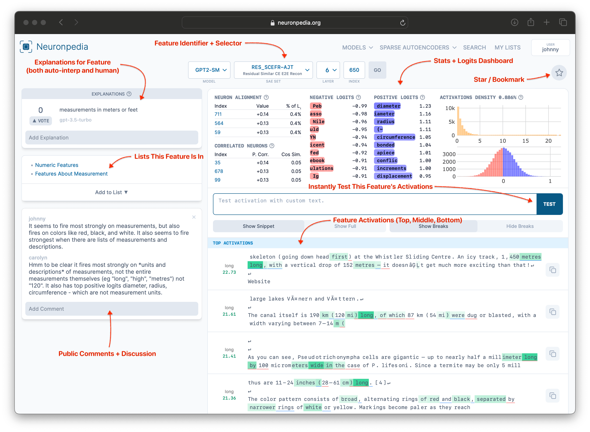
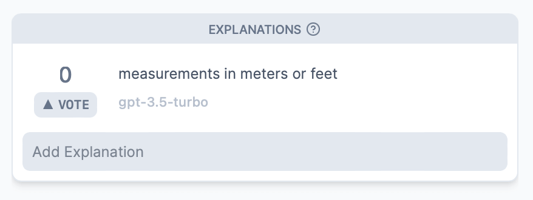
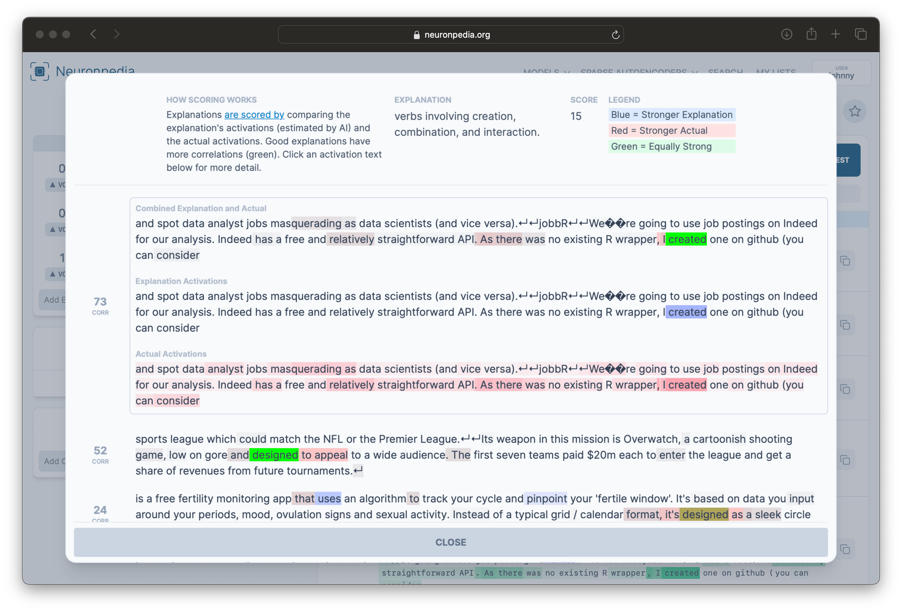
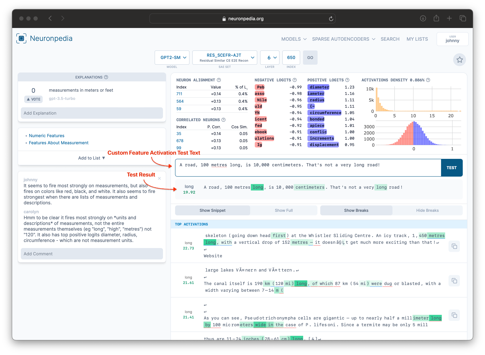

# SAE Features

### What's a Feature?

Sparse Autoencoders identify many **features** in a model, each of which is a "thing that the model knows". A **feature dashboard** on Neuronpedia is an informative and interactive way to examine a feature. It shows us details about specific feature, including statistics, positive and negative logits, and correlated neurons, and top activations. We can also explain add the feature to lists, comment on the feature, and instantly test the feature's activations on custom text.

Each individual feature is located at:
`https://neuronpedia.org/[MODEL_ID]/[SAE_ID]/[FEATURE_INDEX]`

### Example - Feature Page

Here's an [example feature](https://neuronpedia.org/gpt2-small/6-res_scefr-ajt/650) in `GPT2-Small`. There are many things on this page - we'll explain some of them below.

### Example - URL

This feature is for `GPT2-Small`, in layer 6, in the SAE Set `RES_SCEFR-AJT`, at index 650. So its URL is:
[`https://neuronpedia.org/gpt2-small/6-res_scefr-ajt/650`](https://neuronpedia.org/gpt2-small/6-res_scefr-ajt/650)

### Example - Dashboard

Most features on Neuronpedia have an Anthropic-style dashboard that shows basic statistical information about the feature, and top positive and negative logits. Hover over the (?) to see what each section of the dashboard is.

### Example - Explanations

For many features on Neuronpedia, we have shown the top activations to GPT-3.5-Turbo or GPT-4 and asked it to explain what it thinks this feature is about. This is called **automatic interpretation**, or **autointerp** for short. These explanations show up on the top left of the feature page.

You can also vote for explanations, and add your own explanation.
Some explanations are also scored. The score is up to 100, and also uses GPT-3.5-Turbo or GPT-4 to evaluate how good the explanation is. Clicking on a score shows details on how the scoring was performed. Learn more about Neuronpedia's scoring at the [Neuronpedia Scorer Github](https://github.com/hijohnnylin/neuronpedia-scorer).

### Example - Test Activations

Every feature on Neuronpedia can be tested live with custom text, to experiment with and/or validate theories about how a feature behaves. Here's a test for the "Measurement" feature.

### Example - Lists, Comments, Stars

Features can be added to lists, which themselves can have descriptions. Every feature has a comment section for discussion, and features can also be "starred" (bookmarked) for personal reference later on.
