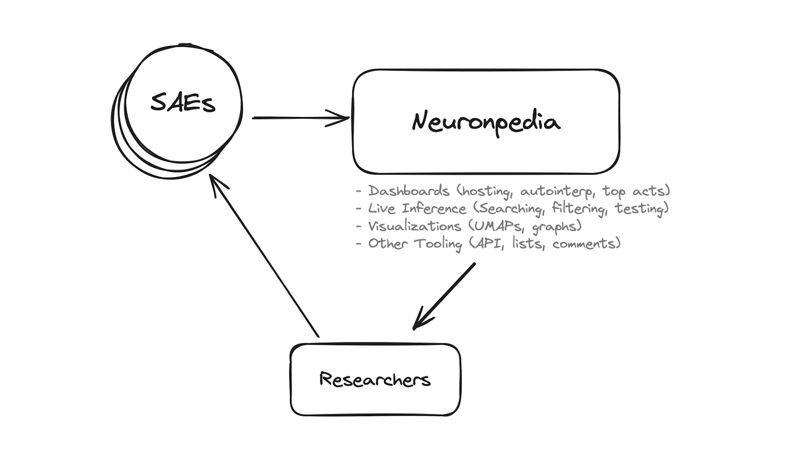

# Introduction

### What is Neuronpedia?

[Neuronpedia](https://neuronpedia.org) is a platform for mechanistic interpretability research. Its goal is to accelerate researchers for **Sparse Autoencoders (SAEs)** by hosting models, feature dashboards, data visualizations, tooling, and more.

These docs explain Neuronpedia's features and how to use them. Please [email us](mailto:johnny@neuronpedia.org) if you have further questions or comments. We love feedback!

### Why Neuronpedia?

TL;DR - Researchers do research. We accelerate them by doing everything else: visualizations, tooling, sharing/collaboration, scaling, and hosting.

- While SAEs are exciting, they introduce a number of engineering challenges which can slow or even prevent research from being done. These challenges arise because SAEs decompose neural networks into distinct features which we are trying to understand.
- Even when working with relatively small language models like GPT2-Small, there are challenges in producing and storing feature dashboards, automatically interpreting features and organizing insights we collect about features.
- As the community produces more SAEs, trains SAEs on larger models and develops better techniques for understanding and analyzing these artifacts, there’s going to be an ever increasing number of engineering challenges in the way of research into model internals.

Continue to the next page to learn about specific Neuronpedia features.
