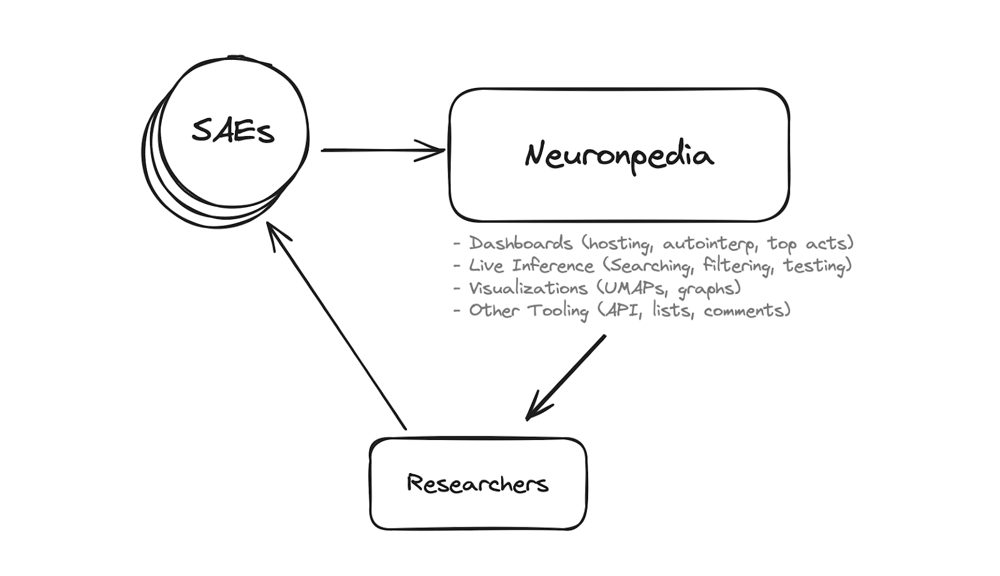

import { Tweet } from "../src/components/Tweet.tsx";
import { TweetNoHeader } from "../src/components/TweetNoHeader.tsx";

# Introduction

### What is Neuronpedia?

[Neuronpedia](https://neuronpedia.org) is a platform for mechanistic interpretability research. Its goal is to accelerate researchers for **Sparse Autoencoders (SAEs)** by hosting models, feature dashboards, data visualizations, tooling, and more.

These docs explain Neuronpedia's features and how to use them. Please [email us](mailto:johnny@neuronpedia.org) if you have further questions or comments. We love feedback!

### Why Neuronpedia?

TL;DR - Researchers do research. We accelerate them by doing everything else: visualizations, tooling, sharing/collaboration, scaling, and hosting.

### Launch Tweets (Short)

Here's our launch tweet thread with demo GIFs and details on what Neuronpedia does:

<Tweet id="1773403396130885844" />
<TweetNoHeader id="1773403397489881423" />
<TweetNoHeader id="1773403398928503024" />

### Detailed Answer & Post

While SAEs are exciting, they introduce a number of engineering challenges which can slow or even prevent research from being done. These challenges arise because SAEs decompose neural networks into distinct features which we are trying to understand.

Neuronpedia solves these problems by providing:

- **Automatic Frontend for SAEs that Scales**: Researchers are busy enough doing research. They
  shouldn&#39;t have to scramble together a frontend to make
  their work presentable/usable before publishing their
  paper. Neuronpedia wants to make publishing your
  interpretability research as easy as clicking {`Upload`}.

- **One Central, Standardized, Searchable Database**: Interpretability researchers have usually created their
  own custom websites to upload and display their data. For
  example, OpenAI&#39;s Neuron Viewer and Neel Nanda&#39;s
  Neuroscope have similar types of data, but totally
  different interfaces, APIs, and data structures.
  Neuronpedia is the free and open website where all the
  interpretability data can be uploaded, searched, compared,
  linked to, exported, tested, etc.

- **Crowdsourcing and Peer Testing**:
  Neuronpedia is used by (and created by!) people who are
  fascinated by AI interpretability. Neuronpedia's tools allow anyone to contribute to explaining, verifying, and analyzing your data. Someone might even find interesting things in your data that you didn't notice! (And vice versa.)

For even more detail and background, check out our launch post on [LessWrong](https://www.lesswrong.com/posts/BaEQoxHhWPrkinmxd/announcing-neuronpedia-as-a-platform-to-accelerate-research).
