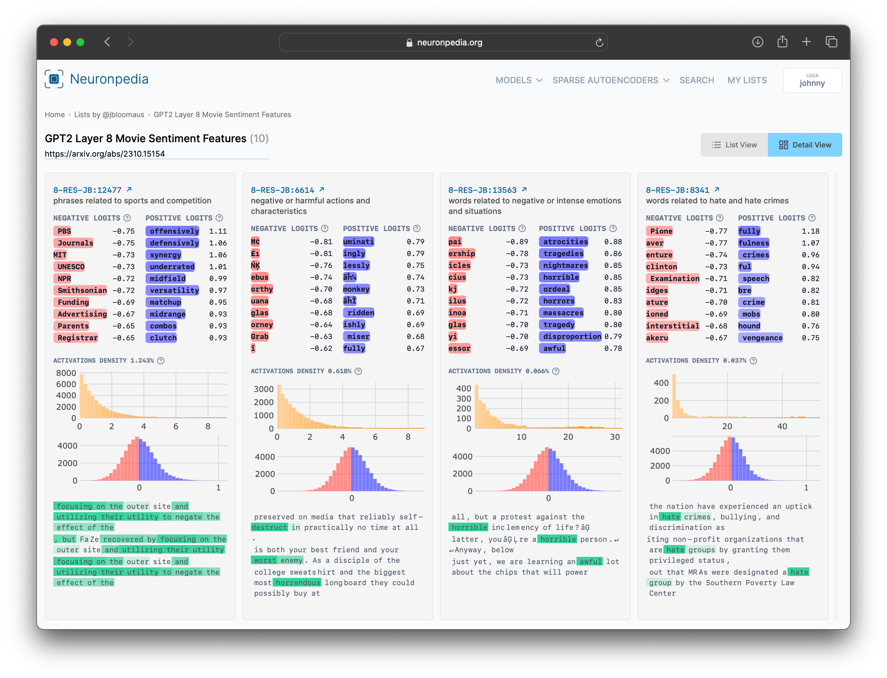

# Lists & Embed Lists

Lists let you save features and link to them in one page. They're commonly used to highlight similar features, but they can be used for any purpose.

- Lists can have mixed features from any SAEs - features don't even have to be from the same model.
- Lists have a title and an optional description.
- List features can have their own description too.

### Example

Here's a list of ["movie sentiment" features](https://www.neuronpedia.org/list/clt3c1c200001298tvcoquyt7) from GPT2-Small, layer 8:


### Creating & Adding To Lists

You can create new lists from any feature page. Just click `Add to List`, then `+ New List`.

To add a feature to an existing list, click `Add to List`, then the list you want to add to.

### Quick Lists

Quick Lists allow you to create a link to a list of features without creating an actual list - all the feature IDs are in the URL itself. It's a quick way to make a list.

Here's a Python snippet to create a quick list:

```
import json
import urllib.parse
import webbrowser

LIST_NAME = "hello, this is a quick list! all the necessary data is in the URL"
LIST_FEATURES = [
    {"modelId": "gpt2-small", "layer": "6-res-jb", "index": "2320"},
    {"modelId": "gpt2-small", "layer": "3-res-jb", "index": "1029"},
]

url = "https://neuronpedia.org/quick-list/"
name = urllib.parse.quote(LIST_NAME)
url = url + "?name=" + name
url = url + "&features=" + urllib.parse.quote(json.dumps(LIST_FEATURES))

print("Opening: " + url)
webbrowser.open(url)
```

The resulting quick list [is here](https://www.neuronpedia.org/quick-list?name=hello%2C%20this%20is%20a%20quick%20list!%20all%20the%20necessary%20data%20is%20in%20the%20URL&features=%5B%7B%22modelId%22%3A%20%22gpt2-small%22%2C%20%22layer%22%3A%20%226-res-jb%22%2C%20%22index%22%3A%20%222320%22%7D%2C%20%7B%22modelId%22%3A%20%22gpt2-small%22%2C%20%22layer%22%3A%20%223-res-jb%22%2C%20%22index%22%3A%20%221029%22%7D%5D).

### Embed Lists (iframe)

Embed lists by appending `?embed=true` to the list link.

For example, here's a list of Twitter-related features, embedded.
Embedded List URL: `https://neuronpedia.org/list/clual45u70003m9z5163dyh98?embed=true`
Embed Code: `<iframe src="https://neuronpedia.org/list/clual45u70003m9z5163dyh98?embed=true" title="Neuronpedia" style="height: 650px; width: 700px;"></iframe>`

And here's what the embed looks like:

<iframe src="https://neuronpedia.org/list/clual45u70003m9z5163dyh98?embed=true" title="Neuronpedia" style={{border: "1px solid #ddd", borderRadius: "10px", width:"700px", height:"650px"}}></iframe>
