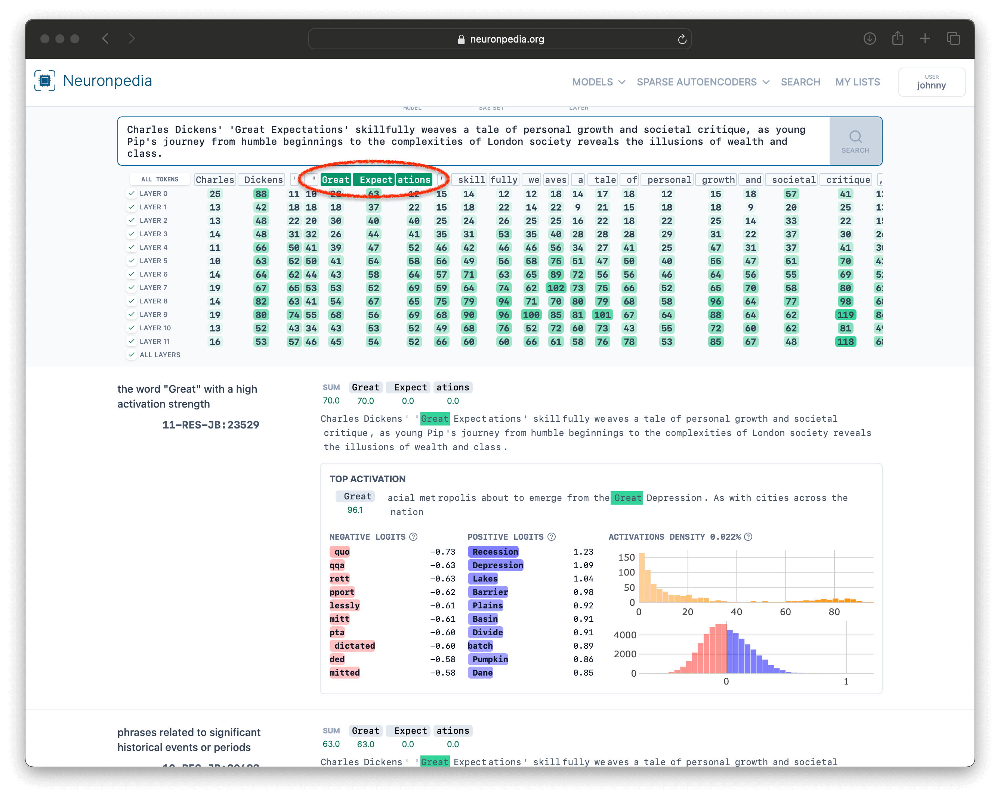

# Search

### What do we mean by "search"?

Neuronpedia supports **searching** all the features of an SAE Set, which **runs inference on arbitrary text through the model to get the top features that activated on that text**.

The result of a search are features in the selected SAE Set. The default sort is by features with the highest activating tokens, but this is customizable, as you'll see later.

### Example Search

Here's an [example search](https://www.neuronpedia.org/gpt2-small/?sourceSet=res-jb&selectedLayers=[]&sortIndexes=[]&q=Charles%20Dickens%27%20%27Great%20Expectations%27%20skillfully%20weaves%20a%20tale%20of%20personal%20growth%20and%20societal%20critique%2C%20as%20young%20Pip%27s%20journey%20from%20humble%20beginnings%20to%20the%20complexities%20of%20London%20society%20reveals%20the%20illusions%20of%20wealth%20and%20class.) of the SAE Set `RES-JB`, using a sentence about the book Great Expectations:

`Charles Dickens' 'Great Expectations' skillfully weaves a tale of personal growth and societal critique, as young Pip's journey from humble beginnings to the complexities of London society reveals the illusions of wealth and class.`

### Sort By Token

What if we're only interested in the top activations of specific tokens?

To sort by the sum of activations of specific tokens, just click to select the tokens in the table and then click "Reload Search". In this example, we selected "Great Expectations" from the search tokens and ran the search again. You can see below that we get different results, with the first result a feature that activates on "Great".

### Filter By Layer

What if we only want to see results from a specific layer?

We can click the checkboxes for specific layers of the SAE Set that we're interested in to only see results of those layers. Below, we've done the same search above (so we're still sorting by "Great Expectations"), but filtered it to layers 2 and 4, so that all results will be from `2-RES-JB` or `4-RES-JB`.

### Case Study: `MLP-OAI` vs GPT2-Small Neurons

How would you use Neuronpedia's search to find specific features? We wrote a mini case study/narrative on this, "[Exploring OpenAI's Latent Directions: Tests, Observations, and Poking Around](https://www.lesswrong.com/posts/QwgYmpnMxBZnmGCsw/exploring-openai-s-latent-directions-tests-observations-and)", which coincided with OpenAI's Sparse Autoencoder release. It's a bit outdated and uses the term "directions" instead of "features". Check it out for some inspiration!
