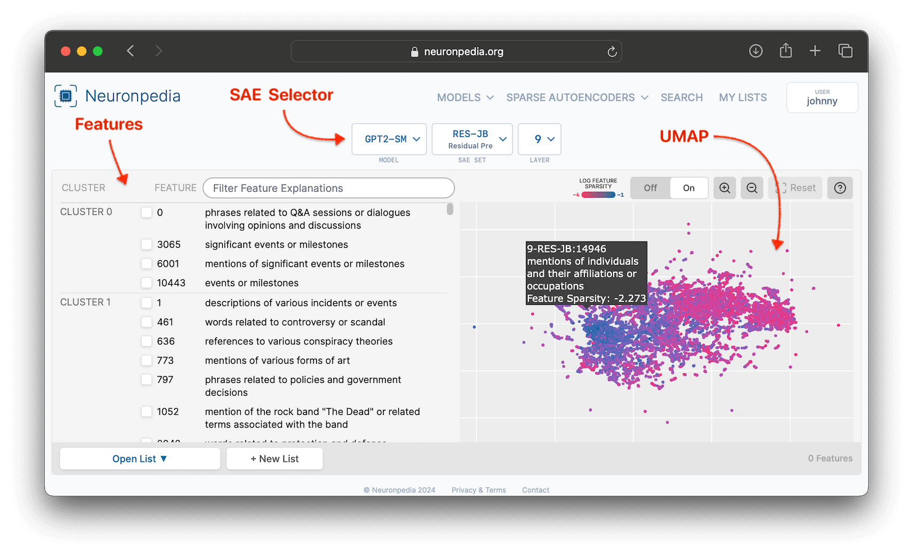
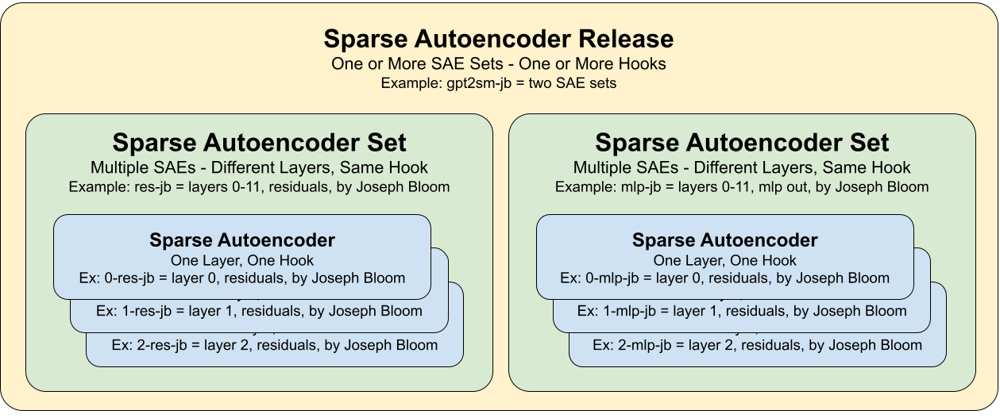

# Sparse Autoencoder

> ⚠️ **Warning:** These docs are in the process of being updated - the latest significant revision was September 2024. Neuronpedia has expanded beyond SAE-specific research to include probes, "concepts", transcoders, and more. Additionally, Neuronpedia has many more functionalities than documented here.

### Sparse Autoencoder Basics

Sparse Autoencoders (SAEs) are a way to extract interpretable features from models. [Here is an explainer on SAEs](https://transformer-circuits.pub/2023/monosemantic-features).

Every Sparse Autoencoder has a unique identifier in the format of `MODEL`@`LAYER`-`DESCRIPTION`-`AUTHOR`.

### Example

The following is the `GPT2-SMALL@9-RES-JB` SAE, which is short for GPT2-Small, Layer 9, Residual Stream, by Joseph Bloom. This SAE is located at [`https://neuronpedia.org/gpt2-small/9-res-jb`](https://neuronpedia.org/gpt2-small/9-res-jb).

### Key Terms: SAE Set & SAE Release

Since each SAE (currently) only corresponds to one layer, and because researchers usually release more than one SAE at a time, we have **two levels of groupings for organizing SAEs**.

- **SAE Set**: One or more SAEs that analyze the same hook and use the same method, across different layers.
  - Example: [RES-JB](https://www.neuronpedia.org/gpt2-small/res-jb) is an SAE Set that has 12 SAEs based on the residual stream of the 12 layers of GPT2-Small.
- **SAE Release**: One or more SAE Sets. This allows grouping of multiple hooks and methods. An SAE Release usually corresponds with the release of a research paper and contains all the SAEs trained/analyzed in it.
  - Example: [P70D-SM](https://www.neuronpedia.org/p70d-sm) is an SAE Release that contains three SAE Sets: Attention Out ([ATT-SM](https://www.neuronpedia.org/pythia-70m-deduped/att-sm)), MLP Post ([MLP-SM](https://www.neuronpedia.org/pythia-70m-deduped/mlp-sm)), and Residuals ([RES-SM](https://www.neuronpedia.org/pythia-70m-deduped/res-sm)).

